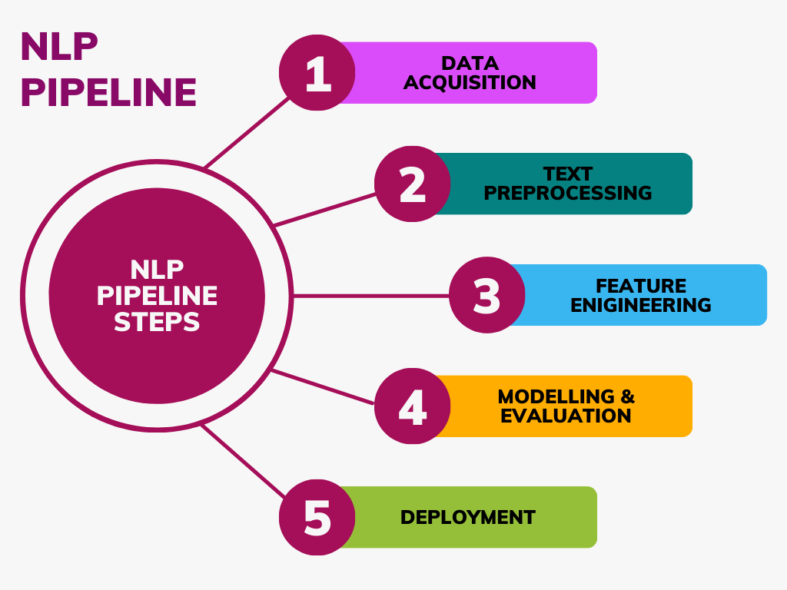

## NLP Pipeline for Cyberbullying Tweet Classification

This project aims to develop a natural language processing (NLP) pipeline to classify tweets based on whether they contain instances of cyberbullying. The goal is to contribute to efforts in detecting and preventing online harassment using NLP. Tweets were preprocessed through a robust NLP pipeline and vectorized using TF-IDF. Two classification models, Linear Support Vector Classifier (SVC) and Multinomial Naive Bayes, were trained and evaluated. A dummy classifier was used as a baseline. The models were then compared.

Tasks completed:

* Conducted a literature review on prior use of NLP and classification models and the performance of these
* Loaded and explored a labelled dataset of tweets related to cyberbullying
* Built an NLP preprocessing pipeline which: expanded contractions, used the tweet preprocessor, used a defined clean function, tokenised and removed stopwords, performed lammatisation and removed repetitions
* Transformed the cleaned text using TF-IDF vectorization
* Implemented and trained three models: Linear Support Vector Classifier (SVC), Multinomial Naive Bayes and a Dummy Classifier as a performance baseline
* Performed hyperparameter tuning with GridSearchCV
* Evaluated all models using: Accuracy, Precision, Recall and F1-score
* Compared results and concluded that Linear SVC outperformed other models.
* Suggested future improvement via ensemble learning (e.g., majority voting classifiers).

